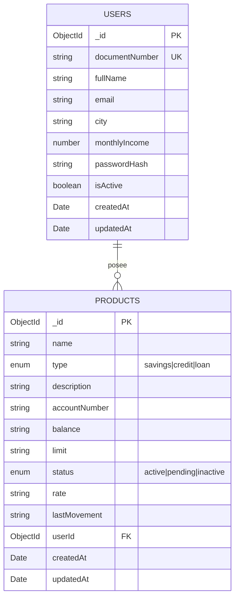

# Product Microservice - Documentacion Tecnica

## Tabla de Contenidos

- [Descripción General](#descripción-general)
- [Arquitectura Interna](#arquitectura-interna)
- [Base de Datos](#base-de-datos)
- [Módulos](#módulos)
- [Endpoints API](#endpoints-api)
- [Schemas MongoDB](#schemas-mongodb)
- [Repository Pattern](#repository-pattern)
- [Configuración](#configuración)
- [Testing](#testing)
- [Desarrollo](#desarrollo)

---

## Descripción General

El **Product Microservice** es un microservicio dedicado a la gestión de productos bancarios y usuarios. Implementado con **NestJS 11** y **MongoDB**, es responsable de:

- CRUD completo de productos bancarios
- Gestión de usuarios y sus datos
- Persistencia en base de datos MongoDB
- Validación de datos y reglas de negocio

### Información del Proyecto

| Propiedad | Valor |
|-----------|-------|
| **Nombre** | products |
| **Puerto** | 4000 |
| **Prefijo** | `/products` |
| **Framework** | NestJS 11 |
| **Base de Datos** | MongoDB (Mongoose) |
| **Lenguaje** | TypeScript |

---

## Arquitectura Interna

```
product/
├── src/
│   ├── main.ts                    # Bootstrap de la aplicación
│   ├── app.module.ts              # Módulo raíz
│   ├── common/                    # Funcionalidades transversales
│   │   ├── correlation-id/        # Gestión de Correlation ID
│   │   └── observability/         # Logging, Health, Tracing
│   └── modules/                   # Módulos de negocio
│       ├── applications/          # Gestión de solicitudes
│       ├── auth/                  # Autenticación
│       ├── products/              # CRUD de productos
│       │   ├── core/
│       │   ├── dto/
│       │   ├── repository/
│       │   ├── schemas/           # Schemas de MongoDB
│       │   └── services/
│       └── users/                 # Gestión de usuarios
│           ├── core/
│           ├── dto/
│           ├── repository/
│           ├── schemas/           # Schemas de MongoDB
│           └── services/
└── test/
    └── app.e2e-spec.ts
```

### Conexión a MongoDB

```typescript
// app.module.ts
@Module({
  imports: [
    MongooseModule.forRootAsync({
      imports: [ConfigModule],
      useFactory: (configService: ConfigService) => ({
        uri: configService.get<string>('MONGODB_URI'),
      }),
      inject: [ConfigService],
    }),
    // ... otros módulos
  ],
})
export class AppModule {}
```

---

## Base de Datos

### Configuración MongoDB

El microservicio se conecta a MongoDB usando Mongoose como ODM (Object Document Mapper).

**Connection String:**
```
mongodb://localhost:27017/bank-products
```

### Colecciones

| Colección | Descripción |
|-----------|-------------|
| `users` | Información de usuarios registrados |
| `products` | Productos bancarios de los usuarios |

---

## Schemas MongoDB

### User Schema

**Colección:** `users`

```typescript
@Schema({ timestamps: true, collection: 'users' })
export class User {
  @Prop({ type: String, required: true, unique: true, index: true })
  documentNumber: string;           // Cédula del usuario

  @Prop({ type: String, required: true })
  fullName: string;                 // Nombre completo

  @Prop({ type: String, unique: true, sparse: true })
  email?: string;                   // Email (opcional)

  @Prop({ type: String, required: true })
  city: string;                     // Ciudad de residencia

  @Prop({ type: Number, required: true })
  monthlyIncome: number;            // Ingresos mensuales

  @Prop({ type: String, required: true })
  passwordHash: string;             // Hash de contraseña (bcrypt)

  @Prop({ type: Boolean, default: true })
  isActive: boolean;                // Estado del usuario
}
```

**Campos Automáticos:**
- `_id`: ObjectId generado por MongoDB
- `createdAt`: Fecha de creación
- `updatedAt`: Fecha de última actualización

**Índices:**
```typescript
// Índice único en documentNumber para búsquedas rápidas
documentNumber: { unique: true, index: true }

// Índice sparse en email (permite múltiples nulls)
email: { unique: true, sparse: true }
```

### Product Schema

**Colección:** `products`

```typescript
@Schema({ timestamps: true, collection: 'products' })
export class Product {
  @Prop({ required: true })
  name: string;                     // Nombre del producto

  @Prop({ required: true, enum: ['savings', 'credit', 'loan'] })
  type: ProductType;                // Tipo de producto

  @Prop()
  description?: string;             // Descripción opcional

  @Prop()
  accountNumber?: string;           // Número de cuenta (auto-generado)

  @Prop({ default: '$0' })
  balance: string;                  // Saldo actual

  @Prop()
  limit?: string;                   // Límite de crédito

  @Prop({ 
    required: true, 
    enum: ['active', 'pending', 'inactive'], 
    default: 'pending' 
  })
  status: ProductStatus;            // Estado del producto

  @Prop()
  rate?: string;                    // Tasa de interés

  @Prop()
  lastMovement?: string;            // Último movimiento

  @Prop({ type: Types.ObjectId, ref: 'User', index: true })
  userId?: Types.ObjectId;          // Referencia al usuario
}
```

**Índices:**
```typescript
// Índice compuesto para consultas de productos por usuario
ProductSchema.index({ userId: 1, status: 1 });
```

### Tipos de Datos

```typescript
// Tipos de producto
export type ProductType = 'savings' | 'credit' | 'loan';

// Estados de producto
export type ProductStatus = 'active' | 'pending' | 'inactive';

// Documentos tipados de Mongoose
export type UserDocument = HydratedDocument<User>;
export type ProductDocument = HydratedDocument<Product>;
```

---

## Módulos

### 1. Users Module

**Responsabilidad:** Gestión completa de usuarios.

#### Estructura

```
users/
├── core/
│   └── use-cases/
├── dto/
│   ├── register-request.dto.ts
│   ├── user-response.dto.ts
│   └── index.ts
├── repository/
│   ├── users.repository.ts        # Interface
│   └── users.repository.mongo.ts  # Implementación MongoDB
├── schemas/
│   ├── user.schema.ts
│   └── index.ts
├── services/
│   └── users.controller.ts
└── users.module.ts
```

### 2. Products Module

**Responsabilidad:** CRUD de productos bancarios.

#### Estructura

```
products/
├── core/
│   └── use-cases/
│       ├── get-products.use-case.ts
│       ├── get-product-by-id.use-case.ts
│       ├── create-product.use-case.ts
│       ├── update-product.use-case.ts
│       └── delete-product.use-case.ts
├── dto/
│   ├── create-product-request.dto.ts
│   ├── update-product-request.dto.ts
│   ├── product-response.dto.ts
│   └── index.ts
├── repository/
│   ├── products.repository.ts        # Interface
│   └── products.repository.mongo.ts  # Implementación MongoDB
├── schemas/
│   ├── product.schema.ts
│   └── index.ts
├── services/
│   └── products.controller.ts
└── products.module.ts
```

---

## Endpoints API

### Products Endpoints

| Método | Endpoint | Descripción |
|--------|----------|-------------|
| GET | `/products/product` | Listar todos los productos |
| GET | `/products/product/user/:userId` | Productos por usuario |
| GET | `/products/product/:id` | Obtener producto por ID |
| POST | `/products/product` | Crear nuevo producto |
| PUT | `/products/product/:id` | Actualizar producto |
| DELETE | `/products/product/:id` | Eliminar producto |

### Health Endpoints

| Método | Endpoint | Descripción |
|--------|----------|-------------|
| GET | `/health` | Estado del servicio |
| GET | `/health/liveness` | Verificación de vida |
| GET | `/health/readiness` | Verificación de preparación |
| GET | `/metrics` | Métricas Prometheus |

---

## Repository Pattern

### Interface del Repositorio

```typescript
export interface ProductsRepository {
  getProducts(): Promise<ProductResponseDto[]>;
  getProductsByUserId(userId: string): Promise<ProductResponseDto[]>;
  getProductById(id: string): Promise<ProductResponseDto>;
  createProduct(dto: CreateProductRequestDto): Promise<ProductResponseDto>;
  updateProduct(id: string, dto: UpdateProductRequestDto): Promise<ProductResponseDto>;
  deleteProduct(id: string): Promise<void>;
}
```

### Implementación MongoDB

```typescript
@Injectable()
export class ProductsRepositoryMongo implements ProductsRepository {
  constructor(
    @InjectModel(Product.name)
    private readonly productModel: Model<ProductDocument>,
  ) {}

  async getProducts(): Promise<ProductResponseDto[]> {
    const products = await this.productModel.find().exec();
    return products.map((product) => this.toResponseDto(product));
  }

  async getProductsByUserId(userId: string): Promise<ProductResponseDto[]> {
    const products = await this.productModel
      .find({ userId: new Types.ObjectId(userId) })
      .exec();
    return products.map((product) => this.toResponseDto(product));
  }

  async getProductById(id: string): Promise<ProductResponseDto> {
    const product = await this.productModel.findById(id).exec();
    if (!product) {
      throw new NotFoundException(`Producto con ID ${id} no encontrado`);
    }
    return this.toResponseDto(product);
  }

  async createProduct(dto: CreateProductRequestDto): Promise<ProductResponseDto> {
    const accountNumber = this.generateAccountNumber();

    const product = new this.productModel({
      name: dto.name,
      type: dto.type,
      description: dto.description,
      accountNumber,
      balance: dto.balance || '$0',
      limit: dto.limit,
      status: 'pending',
      rate: dto.rate,
      userId: dto.userId ? new Types.ObjectId(dto.userId) : undefined,
    });

    const savedProduct = await product.save();
    return this.toResponseDto(savedProduct);
  }

  async updateProduct(id: string, dto: UpdateProductRequestDto): Promise<ProductResponseDto> {
    const product = await this.productModel
      .findByIdAndUpdate(id, { $set: dto }, { new: true })
      .exec();
    
    if (!product) {
      throw new NotFoundException(`Producto con ID ${id} no encontrado`);
    }
    
    return this.toResponseDto(product);
  }

  async deleteProduct(id: string): Promise<void> {
    const result = await this.productModel.findByIdAndDelete(id).exec();
    if (!result) {
      throw new NotFoundException(`Producto con ID ${id} no encontrado`);
    }
  }

  private generateAccountNumber(): string {
    return `****${Math.floor(1000 + Math.random() * 9000)}`;
  }

  private toResponseDto(product: ProductDocument): ProductResponseDto {
    return {
      id: product._id.toString(),
      name: product.name,
      type: product.type,
      description: product.description,
      accountNumber: product.accountNumber,
      balance: product.balance,
      limit: product.limit,
      status: product.status,
      rate: product.rate,
      lastMovement: product.lastMovement,
    };
  }
}
```

---

## DTOs

### CreateProductRequestDto

```typescript
export class CreateProductRequestDto {
  @IsString()
  @IsNotEmpty()
  name: string;

  @IsIn(['savings', 'credit', 'loan'])
  type: ProductType;

  @IsString()
  @IsOptional()
  description?: string;

  @IsString()
  @IsOptional()
  balance?: string;

  @IsString()
  @IsOptional()
  limit?: string;

  @IsString()
  @IsOptional()
  rate?: string;

  @IsString()
  @IsOptional()
  userId?: string;
}
```

### UpdateProductRequestDto

```typescript
export class UpdateProductRequestDto {
  @IsString()
  @IsOptional()
  name?: string;

  @IsString()
  @IsOptional()
  description?: string;

  @IsIn(['active', 'pending', 'inactive'])
  @IsOptional()
  status?: ProductStatus;
}
```

### ProductResponseDto

```typescript
export class ProductResponseDto {
  id: string;
  name: string;
  type: ProductType;
  description?: string;
  accountNumber?: string;
  balance: string;
  limit?: string;
  status: ProductStatus;
  rate?: string;
  lastMovement?: string;
}
```

---

## Configuración

### Variables de Entorno

```env
# Server Configuration
PORT=4000
NODE_ENV=development

# MongoDB
MONGODB_URI=mongodb://localhost:27017/bank-products

# CORS
CORS_ORIGINS=http://localhost:5000

# JWT (para validación de tokens)
JWT_SECRET=your-super-secret-key

# OpenTelemetry (opcional)
OTEL_EXPORTER_OTLP_ENDPOINT=http://localhost:4318
OTEL_SERVICE_NAME=product-service
```

### Configuración de Mongoose

```typescript
// Conexión asíncrona con ConfigService
MongooseModule.forRootAsync({
  imports: [ConfigModule],
  useFactory: (configService: ConfigService) => ({
    uri: configService.get<string>('MONGODB_URI'),
    // Opciones adicionales
    retryWrites: true,
    w: 'majority',
  }),
  inject: [ConfigService],
})
```

---

## Testing

### Ejecutar Tests

```bash
# Tests unitarios
npm run test

# Tests con watch mode
npm run test:watch

# Tests con coverage
npm run test:cov

# Tests e2e
npm run test:e2e
```

### Testing de Repositorios

```typescript
describe('ProductsRepositoryMongo', () => {
  let repository: ProductsRepositoryMongo;
  let model: Model<ProductDocument>;

  beforeEach(async () => {
    const module = await Test.createTestingModule({
      providers: [
        ProductsRepositoryMongo,
        {
          provide: getModelToken(Product.name),
          useValue: {
            find: jest.fn(),
            findById: jest.fn(),
            findByIdAndUpdate: jest.fn(),
            findByIdAndDelete: jest.fn(),
          },
        },
      ],
    }).compile();

    repository = module.get(ProductsRepositoryMongo);
    model = module.get(getModelToken(Product.name));
  });

  it('should return products by userId', async () => {
    const mockProducts = [/* mock data */];
    jest.spyOn(model, 'find').mockReturnValue({
      exec: jest.fn().mockResolvedValue(mockProducts),
    } as any);

    const result = await repository.getProductsByUserId('user-id');
    expect(result).toHaveLength(mockProducts.length);
  });
});
```

---

## Desarrollo

### Scripts Disponibles

```bash
# Desarrollo
npm run start:dev       # Hot reload
npm run start:debug     # Debug mode

# Producción
npm run build           # Compilar
npm run start:prod      # Ejecutar build

# Calidad
npm run lint            # Linting
npm run format          # Prettier
```

### Comandos de MongoDB

```bash
# Conectar a MongoDB local
mongosh mongodb://localhost:27017/bank-products

# Ver colecciones
show collections

# Consultar usuarios
db.users.find()

# Consultar productos de un usuario
db.products.find({ userId: ObjectId("...") })

# Crear índices manualmente
db.products.createIndex({ userId: 1, status: 1 })
```

### Migraciones

Para crear nuevos schemas o modificar existentes:

1. **Modificar el Schema:**
```typescript
// Agregar nuevo campo
@Prop({ type: String, default: 'default_value' })
newField: string;
```

2. **Actualizar documentos existentes:**
```javascript
// En MongoDB shell
db.products.updateMany(
  { newField: { $exists: false } },
  { $set: { newField: 'default_value' } }
)
```

---

## Dependencias Principales

| Paquete | Versión | Propósito |
|---------|---------|-----------|
| `@nestjs/mongoose` | ^11.0.4 | Integración Mongoose con NestJS |
| `mongoose` | ^9.2.1 | ODM para MongoDB |
| `bcrypt` | ^6.0.0 | Hashing de contraseñas |
| `@nestjs/jwt` | ^11.0.2 | Validación de JWT tokens |
| `class-validator` | ^0.14.3 | Validación de DTOs |
| `class-transformer` | ^0.5.1 | Transformación de objetos |

---

## Diagrama de Relaciones



---

*Documentación actualizada: 18 de febrero de 2026*
