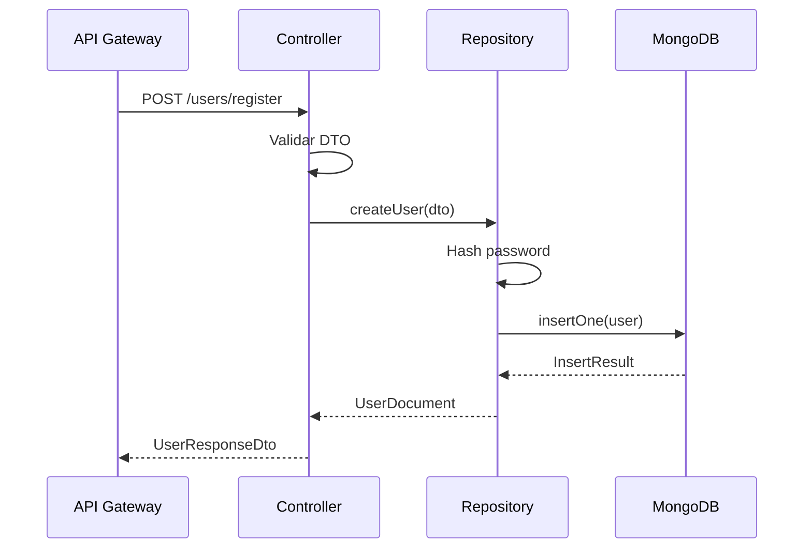

# HU-PM-001: Registro de usuarios

## Descripcion

**Como** microservicio de productos  
**Quiero** persistir usuarios en MongoDB  
**Para** almacenar los datos de clientes del banco

## Criterios de Aceptacion

| # | Criterio | Validacion |
|---|----------|------------|
| 1 | Recibe datos de usuario del API Gateway | POST `/users/register` |
| 2 | Hash de contrasena con bcrypt antes de guardar | Campo `passwordHash` |
| 3 | El numero de documento es unico | Indice unico en MongoDB |
| 4 | Genera timestamps automaticos | `createdAt`, `updatedAt` |
| 5 | Retorna el ID del usuario creado | ObjectId de MongoDB |

## Datos Tecnicos

**Endpoint:** `POST /users/register`

**Schema MongoDB:**
```typescript
@Schema({ timestamps: true, collection: 'users' })
export class User {
  documentNumber: string;  // unique, indexed
  fullName: string;
  email?: string;          // sparse index
  city: string;
  monthlyIncome: number;
  passwordHash: string;
  isActive: boolean;
}
```

**Indices:**
- `documentNumber`: unique, index
- `email`: unique, sparse

## Diagrama de Secuencia



## Archivos Relacionados

- `src/modules/users/services/users.controller.ts`
- `src/modules/users/repository/users.repository.mongo.ts`
- `src/modules/users/schemas/user.schema.ts`
