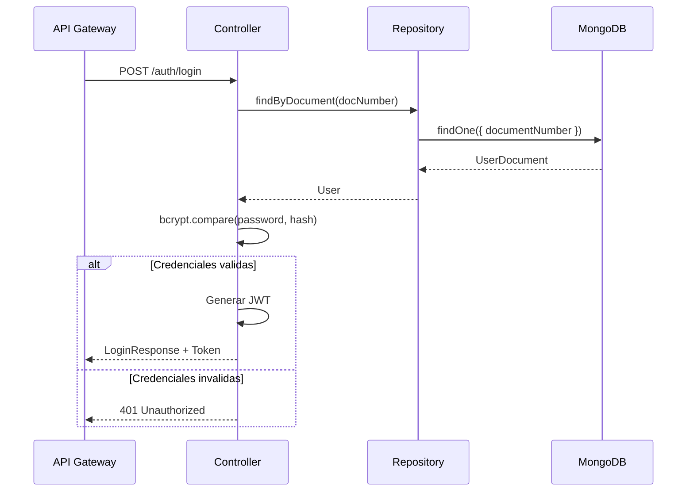

# HU-PM-002: Autenticacion de usuarios

## Descripcion

**Como** microservicio de productos  
**Quiero** validar credenciales de usuarios  
**Para** autenticar el acceso al sistema bancario

## Criterios de Aceptacion

| # | Criterio | Validacion |
|---|----------|------------|
| 1 | Recibe numero de documento y contrasena | POST `/auth/login` |
| 2 | Busca usuario por numero de documento | Query MongoDB |
| 3 | Compara contrasena con hash almacenado | bcrypt.compare() |
| 4 | Genera JWT token si credenciales validas | accessToken |
| 5 | Retorna datos del usuario autenticado | fullName, userId |

## Datos Tecnicos

**Endpoint:** `POST /auth/login`

**Request:**
```json
{
  "documentNumber": "string",
  "password": "string"
}
```

**Response:**
```json
{
  "accessToken": "string",
  "fullName": "string",
  "userId": "string",
  "isRegistered": true
}
```

## Diagrama de Secuencia



## Archivos Relacionados

- `src/modules/auth/services/auth.controller.ts`
- `src/modules/auth/core/use-cases/login.use-case.ts`
- `src/modules/users/repository/users.repository.mongo.ts`
