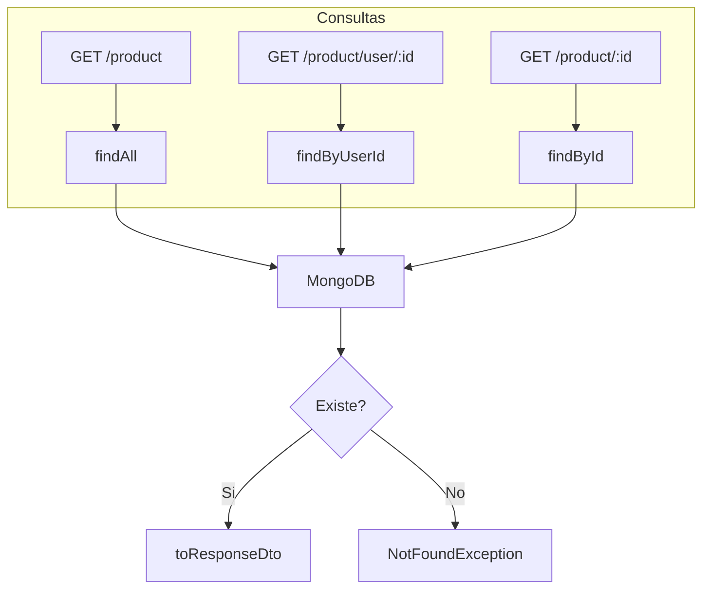

# HU-PM-003: Consulta de productos

## Descripcion

**Como** microservicio de productos  
**Quiero** exponer endpoints para consultar productos  
**Para** que el API Gateway pueda obtener informacion de productos

## Criterios de Aceptacion

| # | Criterio | Validacion |
|---|----------|------------|
| 1 | Lista todos los productos | GET `/products/product` |
| 2 | Filtra productos por usuario | GET `/products/product/user/:userId` |
| 3 | Obtiene producto por ID | GET `/products/product/:id` |
| 4 | Retorna 404 si no existe el producto | NotFoundException |
| 5 | Transforma documento MongoDB a DTO | toResponseDto() |

## Datos Tecnicos

**Endpoints:**

| Metodo | Ruta | Descripcion |
|--------|------|-------------|
| GET | `/products/product` | Listar todos |
| GET | `/products/product/user/:userId` | Por usuario |
| GET | `/products/product/:id` | Por ID |

**Response:**
```json
{
  "id": "string",
  "name": "string",
  "type": "savings | credit | loan",
  "accountNumber": "****1234",
  "balance": "$0",
  "status": "active | pending | inactive"
}
```

## Diagrama de Flujo



## Archivos Relacionados

- `src/modules/products/services/products.controller.ts`
- `src/modules/products/repository/products.repository.mongo.ts`
- `src/modules/products/dto/product-response.dto.ts`
