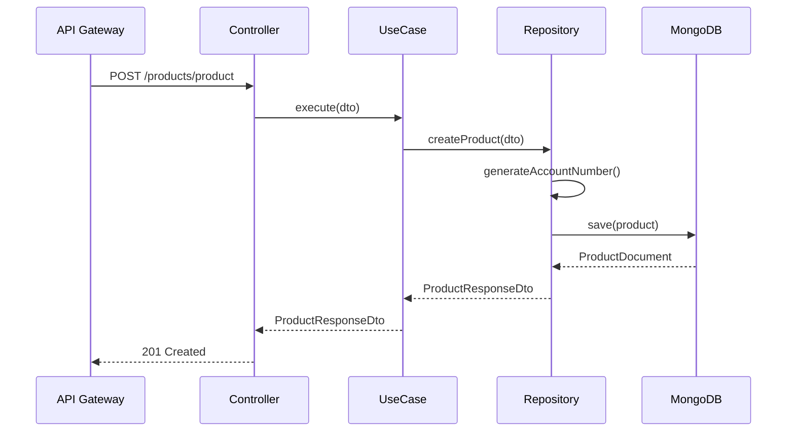

# HU-PM-004: Creacion de productos

## Descripcion

**Como** microservicio de productos  
**Quiero** persistir nuevos productos bancarios  
**Para** registrar productos solicitados por los usuarios

## Criterios de Aceptacion

| # | Criterio | Validacion |
|---|----------|------------|
| 1 | Recibe datos del producto a crear | POST `/products/product` |
| 2 | Genera numero de cuenta automaticamente | Formato `****XXXX` |
| 3 | Establece estado inicial como pendiente | `status: 'pending'` |
| 4 | Asocia producto al usuario correspondiente | Campo `userId` |
| 5 | Genera timestamps automaticos | `createdAt`, `updatedAt` |

## Datos Tecnicos

**Endpoint:** `POST /products/product`

**Request:**
```json
{
  "name": "string",
  "type": "savings | credit | loan",
  "description": "string",
  "balance": "$0",
  "limit": "$5,000",
  "rate": "1.5%",
  "userId": "string"
}
```

**Response:**
```json
{
  "id": "string",
  "name": "string",
  "type": "savings",
  "accountNumber": "****1234",
  "balance": "$0",
  "status": "pending"
}
```

## Diagrama de Secuencia



## Archivos Relacionados

- `src/modules/products/services/products.controller.ts`
- `src/modules/products/core/use-cases/create-product.use-case.ts`
- `src/modules/products/repository/products.repository.mongo.ts`
