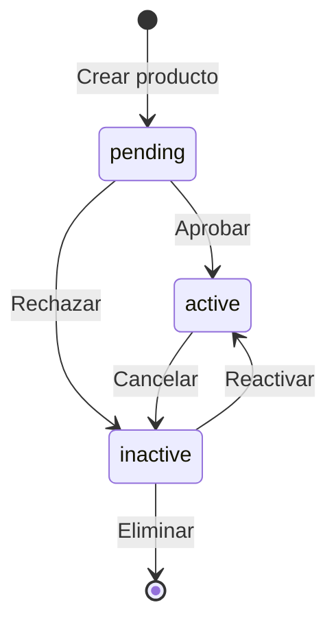
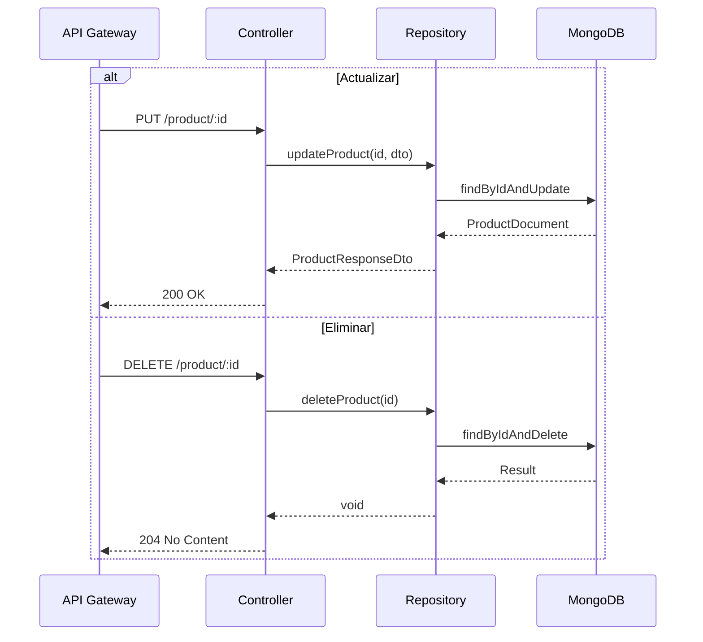

# HU-PM-005: Gestion de productos

## Descripcion

**Como** microservicio de productos  
**Quiero** permitir actualizar y eliminar productos  
**Para** gestionar el ciclo de vida de productos bancarios

## Criterios de Aceptacion

| # | Criterio | Validacion |
|---|----------|------------|
| 1 | Actualiza campos del producto | PUT `/products/product/:id` |
| 2 | Permite cambiar estado del producto | Campo `status` |
| 3 | Elimina producto por ID | DELETE `/products/product/:id` |
| 4 | Retorna 404 si el producto no existe | NotFoundException |
| 5 | Actualiza timestamp en modificaciones | `updatedAt` automatico |

## Datos Tecnicos

**Endpoints:**

| Metodo | Ruta | Descripcion |
|--------|------|-------------|
| PUT | `/products/product/:id` | Actualizar |
| DELETE | `/products/product/:id` | Eliminar |

**Request Update:**
```json
{
  "name": "string",
  "description": "string",
  "status": "active | pending | inactive"
}
```

**Estados posibles:**
- `pending`: Producto recien creado, en revision
- `active`: Producto activo y operativo
- `inactive`: Producto cancelado o suspendido

## Diagrama de Estados



## Diagrama de Secuencia



## Archivos Relacionados

- `src/modules/products/services/products.controller.ts`
- `src/modules/products/core/use-cases/update-product.use-case.ts`
- `src/modules/products/core/use-cases/delete-product.use-case.ts`
- `src/modules/products/repository/products.repository.mongo.ts`
